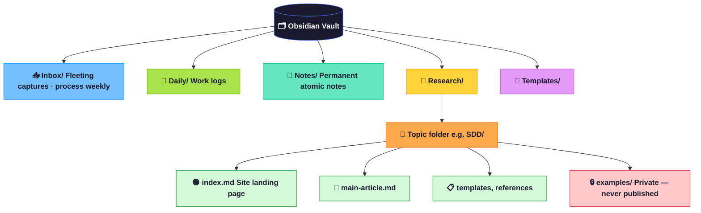
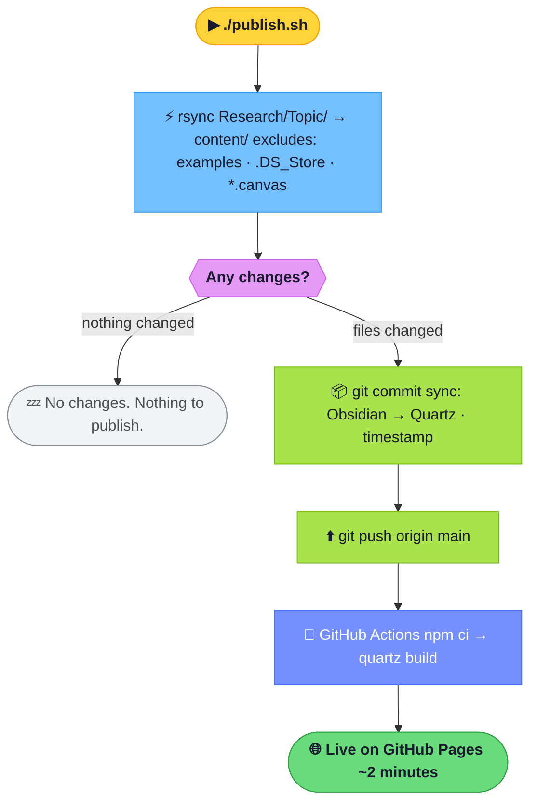
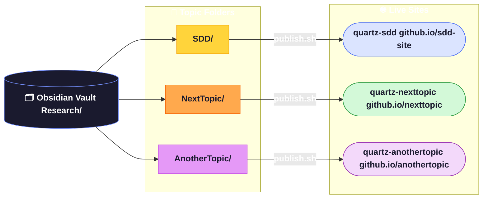
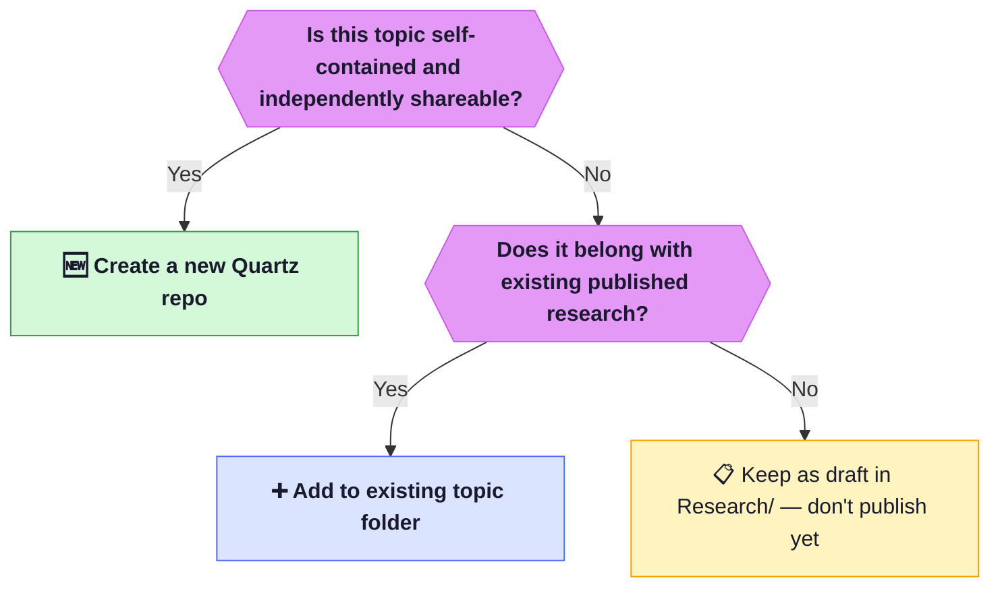

# From Idea to Published Research

Most ideas die in your notes app. Not because they weren't worth developing — but because the path from "rough thought" to "something shareable" has too many friction points. A new tool to learn. A format to figure out. A deployment step that requires twenty minutes of setup you haven't done yet.

This post documents the system I built to eliminate that friction. It uses **Obsidian** as the writing environment and **Quartz** as the publishing engine. Once set up, going from a raw note to a live research site takes a single command.

Here's the full pipeline before we go into each stage:

```mermaid
flowchart LR
    A(["💡 Raw Idea"]):::seed

    subgraph WRITE ["✍️  Write"]
        B["📥 Capture Inbox/"]:::capture
        C["📝 Draft Research/Topic/"]:::draft
        D["🔍 Refine Add index.md"]:::refine
    end

    subgraph SHIP ["🚀  Ship"]
        F["⚙️ publish.sh"]:::script
        G["🤖 GitHub Actions build + deploy"]:::ci
    end

    H(["🌐 Live Site ~2 min"]):::live
    E{{"Ready?"}}:::gate

    A --> B --> C --> D --> E
    E -->|"not yet"| C
    E -->|"ship it"| F
    F --> G --> H

    classDef seed    fill:#ffd43b,stroke:#f59f00,color:#1a1a2e,font-weight:bold
    classDef capture fill:#74c0fc,stroke:#339af0,color:#1a1a2e
    classDef draft   fill:#a9e34b,stroke:#74b816,color:#1a1a2e
    classDef refine  fill:#63e6be,stroke:#20c997,color:#1a1a2e
    classDef gate    fill:#e599f7,stroke:#cc5de8,color:#1a1a2e,font-weight:bold
    classDef script  fill:#ffa94d,stroke:#f76707,color:#1a1a2e,font-weight:bold
    classDef ci      fill:#748ffc,stroke:#4c6ef5,color:#fff
    classDef live    fill:#69db7c,stroke:#2f9e44,color:#1a1a2e,font-weight:bold
```



---

## How the Vault is Organized

Before anything else, you need a structure that doesn't get in your way. Here's what mine looks like:



The key distinction: `Research/Topic/` is where publishable work lives. Everything else is internal scaffolding. The `examples/` folder under each topic stays private — it never gets synced to the live site.

---

## Stage 1 — Capture: Get the Idea Out

**Goal:** Don't lose the thought. Quality doesn't matter here.

Every idea starts in `Inbox/` or a Daily note. One line is enough:

```
- [ ] Idea: coding agents need structured context to avoid hallucination
```

Speed is the only priority at this stage. You move on when you want to develop it further — not before.

---

## Stage 2 — Draft: Give It a Home

**Goal:** Move the idea into a proper research folder and start building it out.

Every topic gets its own folder: `Research/Topic/note.md`. Use frontmatter to track where a note is in its lifecycle:

```yaml
---
title: "Your Research Title"
status: draft        # draft | in-review | approved
tags: [ai, research]
created: 2026-03-26
---
```

**The rules here:**
- One folder per topic
- One idea per file — keep notes atomic
- Use `[[wikilinks]]` to connect ideas as they develop

The `status` field does a lot of work. It tells you at a glance what's ready to ship and what still needs attention.

---

## Stage 3 — Refine: Get It Ready to Publish

**Goal:** Make sure the content is complete, correct, and won't break when Quartz renders it.

Before a topic goes live, it needs an `index.md` — the landing page visitors hit first:

```markdown
---
title: "Topic Name"
---

# Topic Name

One-line description of what this research covers.

## Research
- [[main-article]] — What it covers.

## Templates / Resources
- [[template-file]] — What it's for.
```

Run through this checklist before moving on:


A few things that break silently if you skip them — worth knowing upfront:

| Rule | Why |
|------|-----|
| Mermaid `<tag>` in node labels → use `{tag}` | HTML tags break Mermaid 11 parser |
| `# H1` heading in body → remove it | Quartz renders the title from frontmatter |
| HTML comments before `---` frontmatter → move them after | Frontmatter must start on line 1 |

---

## Stage 4 — Publish: One Command to Go Live

**Goal:** Sync your Obsidian notes to Quartz and deploy to GitHub Pages.

### Understanding the Architecture First

Obsidian and Quartz are two completely separate systems on your machine. They don't talk to each other automatically. The bridge between them is a script called `publish.sh` that lives inside the Quartz repo.


Nothing moves until you run the script. Once you do, three things happen automatically:
1. Changed files are copied from `Research/SDD/` → `quartz-sdd/content/` using `rsync`
2. The changes are committed and pushed to GitHub
3. GitHub Actions picks up the push and deploys the site

### One-Time Setup

```bash
# 1. Clone Quartz
git clone https://github.com/jackyzha0/quartz quartz-topic
cd quartz-topic && npm install

# 2. Point it at your GitHub repo
git remote set-url origin https://github.com/YOUR_ORG/topic-site.git
git push -u origin v4:main

# 3. GitHub → Settings → Pages → Source: GitHub Actions
```

Then open `publish.sh` and update the `VAULT` variable to point at your Obsidian topic folder — this is the only line that connects the two systems:

```bash
VAULT="/Users/YOUR_NAME/Library/Mobile Documents/.../Research/YOUR_TOPIC"
```

### Controlling What Gets Published

By default, `rsync` copies everything. To keep certain folders private, add `--exclude` flags:

```bash
rsync -a --delete --delete-excluded \
  --exclude='.DS_Store' \
  --exclude='*.canvas' \
  --exclude='.obsidian/' \
  --exclude='examples/' \       ← private internal samples
  --exclude='drafts/' \         ← work in progress
  "$VAULT/" "$CONTENT_DIR/"
```

The `--delete-excluded` flag is important — without it, folders you've excluded will stay in `content/` from previous syncs even after you add the exclude rule.

### What Gets Published vs. What Stays Private

| Published | Excluded |
|-----------|----------|
| All `.md` files in your topic folder | `examples/` folder |
| Subfolders | `.DS_Store` · `*.canvas` · `.obsidian/` |
| New files added since last run | Files deleted in Obsidian are deleted in `content/` too |

### Every Publish Thereafter

```bash
./publish.sh              # sync → commit → push → live in ~2 min
./publish.sh --preview    # sync + local preview only (no push)
```

Here's what the script does end-to-end:



---

## Scaling to Multiple Topics

Each topic gets its own Quartz repo. Sites stay independent and focused.



When to spin up a new repo:



---

## Local Preview Tips

Before pushing, always verify locally:

```bash
# Sync from Obsidian + start local preview (no push)
./publish.sh --preview

# Force clean rebuild — clears stale cached pages
rm -rf public/ && npx quartz build --serve

# Inspect what will be committed before pushing
git diff --staged content/
```

---

## The Mental Model

The whole system rests on one insight: **Obsidian and Quartz never talk to each other directly.** `publish.sh` is the only connection. If you edit a note in Obsidian and don't run the script, the live site won't change.

That's a feature, not a bug. You control exactly when your work goes public.

---

## References

- Quartz docs: https://quartz.jzhao.xyz
- Quartz Syncer plugin (publish directly from Obsidian UI — future option): https://github.com/saberzero1/quartz-syncer
- SDD site repo: https://github.com/VenkateshDas/sdd-site
